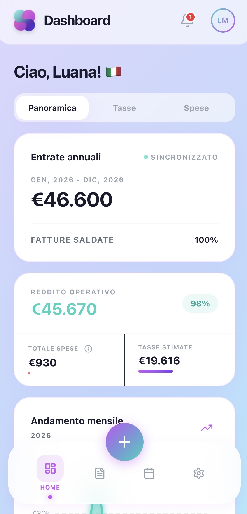
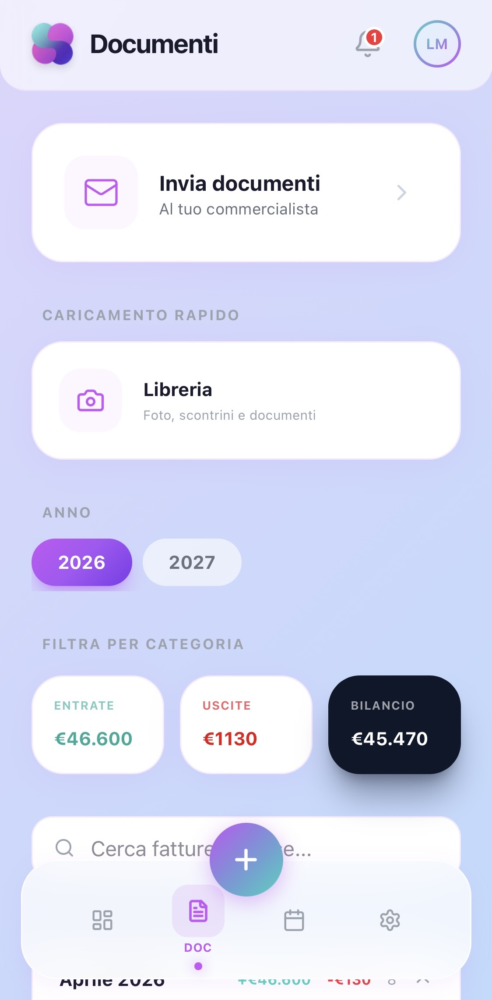
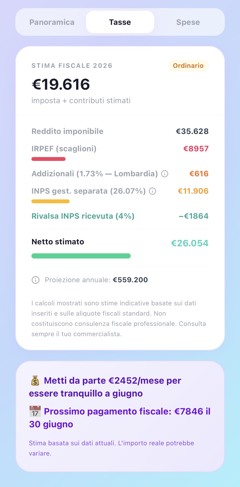

<div align="center">


# Solvy

**Gestione fiscale per freelancer. Senza ansia, senza Excel, senza sorprese.**

Solvy è una PWA mobile-first che calcola in tempo reale quanto devi al fisco, emette fatture conformi e ti ricorda le scadenze — pensata per freelancer italiani (forfettario e ordinario) e autónomos spagnoli (estimación directa).

[](https://solvyapp.com)
[]()
[]()
[]()
[]()
[]()

[Website](https://solvyapp.com) · [Report a bug](https://github.com/luanamessa96-lgtm/Applicazione-per-freelance-/issues) · [Request a feature](https://github.com/luanamessa96-lgtm/Applicazione-per-freelance-/issues)

</div>

---

## Screenshots

<div align="center">
<table>
<tr>
<td align="center"><br/><sub>Dashboard</sub></td>
<td align="center"><br/><sub>Fattura</sub></td>
<td align="center"><br/><sub>Calcolo tasse</sub></td>
<td align="center"><br/><sub>Scadenze</sub></td>
</tr>
</table>
</div>

---

## Perché Solvy

Il freelancer medio non vuole imparare a fare il commercialista. Vuole sapere una cosa sola: **quanto soldi deve mettere da parte questo mese**. Solvy risponde a questa domanda in tempo reale, ogni volta che emette una fattura.

- **Niente sorprese.** Ogni fattura aggiorna istantaneamente quanto dovrai al fisco.
- **Niente Excel.** Calcoli, scadenze e archivio fatture in un'unica app.
- **Niente telefonate.** Le regole fiscali di Italia e Spagna sono codificate, non interpretate.

Solvy non sostituisce il commercialista. Sostituisce l'ansia di non sapere.

---

## Feature

### Fiscalità Italia
- Regime **forfettario** (tutti i coefficienti di redditività per codice ATECO)
- Regime **ordinario** con deduzione INPS dalla base IRPEF (art. 10 TUIR)
- Addizionali regionali e comunali aggiornate 2025/2026
- Gestione **cause ostative** con warning in-app
- Scadenze IVA trimestrali per ordinario, acconti e saldi

### Fiscalità Spagna
- **IRPF** con calcolo cumulativo Modelo 130 (formula AEAT)
- **RETA** con calendario virtuale delle scadenze
- **Modelo 303** (IVA trimestrale) e **Modelo 390** (riepilogo annuale)
- Gestione **retenciones**, **factura rectificativa**, **Libro Registro**, **presupuesto**

### Fatturazione
- PDF professionale conforme IT + ES
- Numerazione automatica per anno fiscale
- Cliente anagrafica, preventivi (ES), note di credito (IT + ES)

### Pro (€7,99/mese o €59,99/anno)
- Fatture illimitate (free: 10/mese)
- Card **"Metti da parte" / "Aparta para impuestos"**
- Export CSV per commercialista
- Temi personalizzati (light/dark)

---

## Tech stack

| Layer | Stack |
|---|---|
| **Frontend** | React 18, TypeScript, Vite, TailwindCSS |
| **Backend** | Supabase (Postgres + Auth + Realtime + Edge Functions) |
| **Payments** | Stripe (live), Customer Portal, webhook firmati |
| **Email** | Resend (transazionale), Loops.so (marketing automation) |
| **Hosting** | Vercel (Edge Network, custom domain) |
| **Security** | Cloudflare WAF, security headers A+, RLS su tutte le tabelle |
| **Observability** | Sentry (error tracking), Uptime Robot, GA4, Telegram alerts bot |
| **Testing** | Vitest (110 test su logica fiscale) |
| **i18n** | ~280 chiavi, italiano + spagnolo |

---

## Architettura

Solvy è progettata attorno a un principio chiave: **un utente = un profilo fiscale paese = immutabile**. Il paese si sceglie all'onboarding e non cambia mai (cambiare residenza fiscale richiede un account nuovo — come nella vita reale).

```
src/
├── countries/          # Moduli fiscali per paese
│   ├── types.ts        # Interfaccia CountryModule
│   ├── it.ts           # Italia (forfettario + ordinario)
│   ├── es.ts           # Spagna (estimación directa)
│   └── index.ts        # Registry
├── components/         # UI components (Tailwind)
├── hooks/              # React hooks (Supabase, Stripe)
├── lib/                # Utils (PDF, calcoli, i18n)
└── pages/              # Routes
```

Aggiungere un nuovo paese significa aggiungere un nuovo modulo in `countries/` che implementa l'interfaccia `CountryModule`. Zero cambiamenti nel resto del codice.

---

## Quality

- **110 test automatici** (Vitest) che coprono tutta la logica fiscale IT + ES
- **Lighthouse 70+** su mobile, LCP ridotto da 4.42s a 1.39s
- **Security headers A+** (securityheaders.com)
- **RLS** abilitato su tutte le tabelle Supabase
- **Rate limiting** su login (5 tentativi → lockout 15 min)
- **GDPR compliant**: Privacy Policy, ToS e Cookie Policy conformi alla legge spagnola (LSSI)
- **CSP** stretta, nessun `unsafe-inline` non necessario

---

## Setup locale

> **Nota:** Solvy è software proprietario. Il codice è pubblico per trasparenza e credibilità, ma non è open source. Per eseguirlo servono credenziali Supabase/Stripe/Resend tue.

```bash
# Clone
git clone https://github.com/luanamessa96-lgtm/Applicazione-per-freelance-.git
cd Applicazione-per-freelance-

# Install
npm install

# Env (copia e compila con le tue credenziali)
cp .env.example .env.local

# Dev
npm run dev

# Test
npm test

# Build
npm run build
```

### Variabili d'ambiente richieste

```
VITE_SUPABASE_URL=
VITE_SUPABASE_ANON_KEY=
VITE_STRIPE_PUBLISHABLE_KEY=
VITE_RESEND_API_KEY=
VITE_SENTRY_DSN=
VITE_GA_MEASUREMENT_ID=
```

---

## Roadmap

- [x] Italia — forfettario + ordinario
- [x] Spagna — estimación directa
- [x] Fatturazione PDF IT + ES
- [x] Stripe live + Customer Portal
- [x] PWA installabile
- [ ] Francia — micro-entrepreneur *(Q3 2026)*
- [ ] Portogallo — regime simplificado *(Q4 2026)*
- [ ] Import automatico fatture da email *(2026)*
- [ ] API per commercialisti *(2026)*

---

## Disclaimer

Tutti i calcoli fiscali forniti da Solvy sono **stime** basate sulla normativa vigente e non costituiscono consulenza fiscale professionale. Per dichiarazioni ufficiali e casi complessi rivolgiti sempre al tuo commercialista o *asesor fiscal*.

---

## License

Software proprietario © 2026 Luana Messa. Tutti i diritti riservati. Il codice è pubblicato per trasparenza; non è concessa licenza d'uso, modifica o redistribuzione.

---

<div align="center">
<sub>Costruito a Madrid con caffè e determinazione.</sub>
</div>
